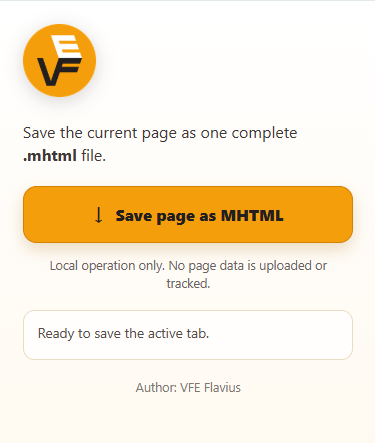

# VFE MHTML 001

A small Google Chrome extension that saves the active tab as one complete MHTML (`.mhtml`) file.

<p align="center">
  
</p>

- **Author:** Flavius
- **Repository:** `flavius-vfe/VFE-MHTML-001`
- **Release:** 001
- **Build:** 1
- **Manifest:** V3
- **Chrome version:** 116 or later
- **License:** MIT

## Features

- Saves the current page through Chrome's native `pageCapture.saveAsMHTML()` API.
- Opens a Save As dialog with a safe page-title and UTC timestamp filename.
- Uses only local HTML, CSS, JavaScript, and PNG assets.
- Contains no analytics, advertisements, API keys, tokens, private keys, remote scripts, external fonts, or third-party libraries.
- Requests no host permissions and does not run automatically on websites.

## Install for local testing

1. Extract the release ZIP.
2. Open `chrome://extensions` in Google Chrome.
3. Enable **Developer mode**.
4. Select **Load unpacked**.
5. Choose the extracted `VFE-MHTML-001-release-001-build1` folder.
6. Pin **VFE MHTML 001** to the toolbar if desired.

## Use

1. Open the page you want to preserve.
2. Select the VFE MHTML 001 toolbar icon.
3. Select **Save page as MHTML**.
4. Choose a filename and destination in Chrome's Save As dialog.

Chrome protects internal pages such as `chrome://extensions`, so those pages cannot be captured by extensions. Some pages may also restrict or fail capture because of browser security rules.

## Permissions

| Permission | Purpose |
| --- | --- |
| `activeTab` | Provides temporary access to the active tab only after the user invokes the extension. |
| `pageCapture` | Uses Chrome's native API to create the MHTML snapshot. |
| `downloads` | Opens the Save As dialog and writes the selected `.mhtml` file. |

The extension has no `host_permissions` entry.

## Privacy

Page content is processed locally by Chrome and saved only to the location selected by the user. The extension does not transmit, collect, sell, log, or analyze browsing data. See [PRIVACY.md](PRIVACY.md).

## Project files

```text
manifest.json
background.js
popup.html
popup.css
popup.js
icons/
LICENSE
README.md
PRIVACY.md
SECURITY.md
CHANGELOG.md
.gitignore
```

## License choice

This release uses the **MIT License**, a permissive open-source license that allows free use, modification, and redistribution while requiring preservation of the license and copyright notice.

Other common permissive alternatives for similar projects include **Apache-2.0** (includes an explicit patent grant), **BSD-3-Clause** (includes a non-endorsement clause), and **0BSD** (minimal conditions). Only MIT applies to this release; the alternatives are mentioned for comparison and are not additional licenses for this project.

## Third-party components

None. This release contains no third-party libraries or remotely hosted code.
